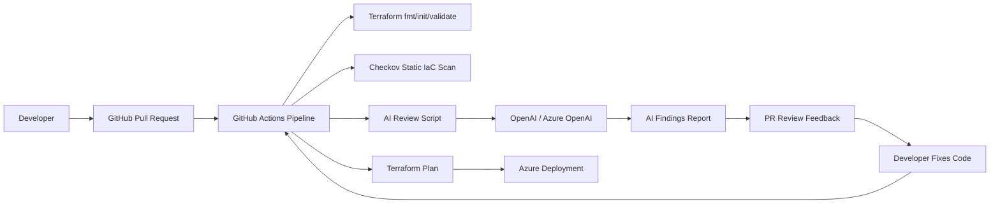

# Member 2 — Cloud Architecture & IaC Grounding

## Your Main Message
Our solution inserts an AI-assisted review step into the normal DevOps pull request workflow. The goal is to catch cloud security, cost, and governance issues before Terraform code is merged or deployed.

## Slide 1: IaC Grounding
Infrastructure as Code means cloud infrastructure is created from code files instead of manual portal clicks. In this project, Terraform acts like a repeatable recipe for Azure infrastructure.

Why this matters:
- Infrastructure changes become version-controlled.
- Pull requests can be reviewed before deployment.
- The same environment can be recreated consistently.
- Mistakes in code can also be scanned automatically before they reach Azure.

## Slide 2: Cloud Architecture

## Component Explanation

### Developer
Creates or updates Terraform code and opens a pull request.

### GitHub Repository
Stores Terraform code, workflow files, and the AI review script.

### GitHub Pull Request
Acts as the control point where code is reviewed before merging.

### GitHub Actions
Runs the automated workflow when a pull request is opened or updated.

### Terraform Validation
Checks that the Terraform code is formatted, initialized, and syntactically valid.

### Checkov
Provides a policy-as-code security scan for known IaC misconfigurations.

### AI Review Script
Reads the Terraform file and sends it to an LLM with a structured review prompt.

### OpenAI / Azure OpenAI
Analyzes the IaC and returns findings categorized by severity.

### PR Feedback
The findings help developers fix issues before deployment.

### Azure Deployment
After fixes, Terraform plan/apply can deploy the approved infrastructure to Azure.

## End-to-End Flow Script
First, a developer opens a pull request with Terraform changes. GitHub Actions starts automatically. The pipeline validates the Terraform file, runs a static scanner such as Checkov, and then runs our AI review script. The AI reviews the same Terraform code for security, cost, and governance issues. It returns structured findings, such as open SSH access, public storage, missing tags, or oversized VM choices. The developer fixes the code and pushes again. When the pipeline passes, the team can continue to Terraform plan or deployment.

## Why This Architecture Works
- It fits naturally into a DevOps workflow.
- It catches problems before deployment.
- It combines deterministic tools like Checkov with flexible AI analysis.
- It supports security, cost control, and governance.
- It does not replace senior engineers; it gives them a faster first review.
